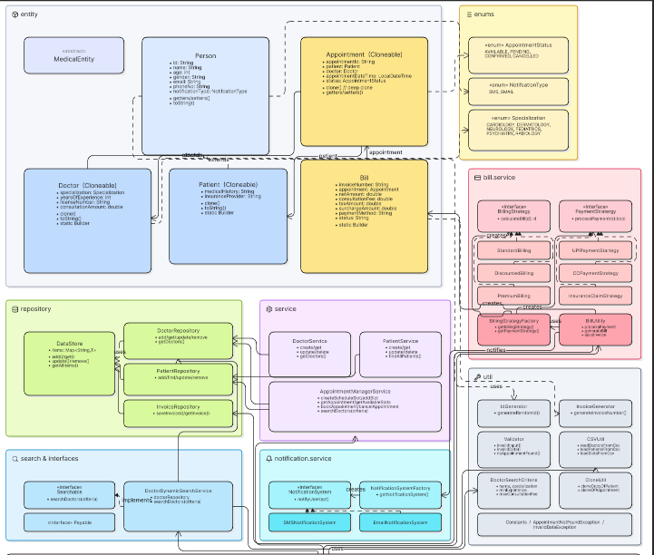

# Java Version Details

* **JDK Version:** 8

# 🌍 Hello World: Execution Guide

This document briefly explains how a Java "Hello World" program runs.

## The Source Code & Console output

The process starts with a `HelloWorld.java` file.


```java
public class HelloWorld {
    public static void main(String[] args) {
        System.out.println("Hello, World!");
    }
}
```
uml.png
```
  title MediTrack Medical Appointment System

  doctors [icon: user-check, color: blue] {
    id string pk
    name string
    age int
    gender string
    email string
    phoneNo string
    notificationType string
    specialization string
    yearsOfExperience int
    licenseNumber string
    consultationAmount double
  }

  patients [icon: user, color: green] {
    id string pk
    name string
    age int
    gender string
    email string
    phoneNo string
    notificationType string
    medicalHistory string
    insuranceProvider string
  }

  appointments [icon: calendar, color: orange] {
    appointmentId string pk
    patientId string fk
    doctorId string fk
    appointmentDateTime timestamp
    status string
  }

  bills [icon: credit-card, color: purple] {
    invoiceNumber string pk
    appointmentId string fk
    consultationFee double
    taxAmount double
    surchargeAmount double
    discountAmount double
    netAmount double
    paymentMethod string
    status string
    issuedAt timestamp
  }

  // Relationships
  appointments.doctorId > doctors.id
  appointments.patientId > patients.id
  bills.appointmentId - appointments.appointmentId
  ```
  

# MediTrack Interactive Menu — Comprehensive Test Execution Guide

This document provides a step-by-step test script to validate the console-driven user interface and business logic of the **MediTrack** application.

---

## 🛠️ Setup, Compilation, and Launch

### 1. Project Directory Structure
Ensure your compiled classes are isolated from your source files. Your working directory layout should look like this:
```text
meditrack-project/
├── bin/                              # Generated binaries go here
└── src/
    └── com/
        └── airtribe/
            └── meditrack/
                ├── service/          # AppointmentManagerService, DoctorService, etc.
                ├── ui/               # Main.java
                └── ... (entities, repository, enums, exception, util)
 ```

## 🧪 Interactive Menu Test Cases

### Test Case 1: Onboard a New Doctor Profile

-   **Objective:** Verify that a doctor can be registered with specific parameters and that an auto-generated unique ID is assigned.

### - **pass command line argument as --loadData to load data provided in csv files for doctors, patients and appointments available in docs folder**
    
-   **Steps:**
    
    1.  Select Option: `2` (Add Doctor)
        
    2.  Input the following details exactly when prompted:
        
        -   _Name:_ `Dr. Sarah Smith`
            
        -   _Email:_ `sarah.smith@meditrack.com`
            
        -   _Mobile:_ `9999911111`
            
        -   _alertType (SMS/EMAIL):_ `SMS`
            
        -   _age:_ `42`
            
        -   _gender (Male/Female):_ `Female`
            
        -   _specialization:_ `CARDIOLOGY`
            
        -   _years of experience:_ `12`
            
        -   _consultation amount:_ `150.0`
            
    3.  Select Option: `1` (Get All Doctors) to print the registry.
        
-   **Expected Result:** The console prints the list showing `Dr. Sarah Smith`. **Note down and copy the generated doctor ID string** (e.g., a randomly generated string/UUID) displayed in the console for use in subsequent test cases.
    

### Test Case 2: Register a New Patient

-   **Objective:** Verify that a patient profile can be built and tracked safely inside the in-memory repository.
    
-   **Steps:**
    
    1.  Select Option: `7` (Add Patient)
        
    2.  Input the following details when prompted:
        
        -   _Name:_ `John Doe`
            
        -   _Email:_ `john.doe@mail.com`
            
        -   _mobile:_ `8888822222`
            
        -   _alertType (SMS/EMAIL):_ `EMAIL`
            
        -   _age:_ `30`
            
        -   _gender (Male/Female):_ `Male`
            
        -   _insuranceProvider:_ `BlueCross`
            
    3.  Select Option: `6` (Get All Patients) to print the list.
        
-   **Expected Result:** The console displays `John Doe` with a unique ID record. **Note down and copy this patient ID string** for the upcoming booking workflow.
    

### Test Case 3: Generate an Available Appointment Slot

-   **Objective:** Verify that an administrator can allocate an empty time slot using the strict date format constraint (`dd-MM-yyyy HH:mm`).
    
-   **Steps:**
    
    1.  Select Option: `12` (Add Appointment Slot)
        
    2.  Input parameters when prompted:
        
        -   _date (dd-MM-yyyy HH:mm) format:_ `15-06-2026 09:30`
            
        -   _doctor Id:_ Paste the **Doctor ID** copied from _Test Case 1_.
            
    3.  Select Option: `11` (Get All Available Slots).
        
-   **Expected Result:** The console lists the new appointment slot displaying a state of `AVAILABLE` alongside its own newly generated unique **Appointment ID**. **Copy this Appointment ID string**.
    

### Test Case 4: Complete an End-to-End Appointment Booking

-   **Objective:** Validate transaction processing, billing strategy invocation, and lifecycle state changes from `AVAILABLE` to `PENDING`.
    
-   **Steps:**
    
    1.  Select Option: `13` (Book Appointment)
        
    2.  Input parameters when prompted:
        
        -   _Enter patientId:_ Paste the **Patient ID** copied from _Test Case 2_.
            
        -   _Enter appointmentId:_ Paste the **Appointment ID** copied from _Test Case 3_.
            
    3.  The backend calculates pricing via `BillingStrategyFactory` and prompts for processing options:
        
        -   _select the payment type UPI/Credit Card/Insurance:_ Type `UPI`
            
-   **Expected Result:** * The terminal outputs pricing context messages: `please proceed for the payment of ...`
    
    -   The internal slot status modifies successfully to `PENDING`.
        

### Test Case 5: Query a Specific Appointment

-   **Objective:** Verify that individual appointment entities can be fetched and inspected directly via their ID.
    
-   **Steps:**
    
    1.  Select Option: `14` (Get Appointment)
        
    2.  Input parameters:
        
        -   _Enter appointment Id:_ Paste the **Appointment ID** tracked since _Test Case 3_.
            
-   **Expected Result:** The system dumps the stringified properties of the object to the terminal, showing the assigned patient mapping and the updated `PENDING` status.
    

### Test Case 6: Dynamic Multi-Criteria Doctor Search

-   **Objective:** Verify that complex stream filtering works seamlessly across text matching, experience boundaries, and fee maximums.
    
-   **Steps:**
    
    1.  Select Option: `16` (Doctor Dynamic Search)
        
    2.  Input search dimensions when prompted:
        
        -   _Enter name:_ `Sarah`
            
        -   _Enter min years of experience:_ `10`
            
        -   _Enter consultation amount:_ `200.0`
            
        -   _Enter specialization:_ `cardiology`
            
-   **Expected Result:** The engine performs a case-insensitive search and outputs a list containing `Dr. Sarah Smith` as an exact structural match.
    

### Test Case 7: AI based available slot suggestions based on patient symptom

-   **Objective:** Verify text search of symptom is giving the suggested slots for appointment booking
    
-   **Steps:**
    
    1.  Select Option: `17` (recommended Slots based On Symptom)
        
    2.  Input search dimensions when prompted:
        
        -   _Enter symptom:_ `chest pain`

        
-   **Expected Result:** The application exits the running loop immediately and displays the suggested slots available to book appointment with option 13


### Test Case 8: Graceful Termination

-   **Objective:** Verify clean resource cleanup and terminal loop termination.
    
-   **Steps:**
    
    1.  Select Option: `0` (Exit)
        
-   **Expected Result:** The application exits the running loop immediately and displays the message: `Exiting the interactive menu window.
